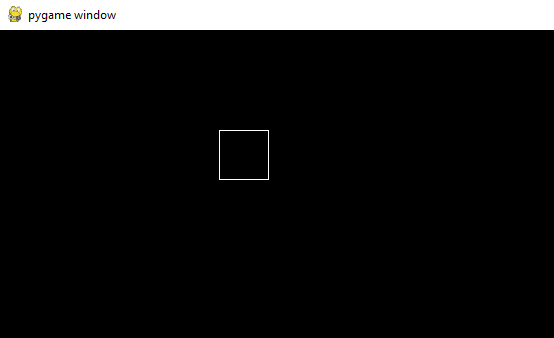

# Урок 1 - Базовый игровой цикл
Приветствую!
Это первый урок из цикла изучения библиотеки pygame


Сегодня мы рассмотрим основной алгоритм работы приложений, написанных с помощью библиотеки pygame.

## Введение
Если кратко, pygame – это набор модулей языка python для написания графических приложений, работе с событиями пользователя и другими базовыми аспектами для разработки игр.

Давайте сегодня создадим простой шаблонный проект. Вот так просто он будет выглядеть в итоге. Небольшой кубик передвигается по полю.


Если вам будет интересно — могу сделать краткий курс разработки на языке python, где мы быстро пройдёмся по основным его аспектам и научимся писать простые программы.

Разделим приложение на три модуля. Главный скрипт `main.py`, модуль с классом игрока `player.py` и модуль с настройками игры `settings.py`.


## setting.py
Начнём с настроек
Задаём значение ширины и высоты окна
Задаём количество кадров в секунду (frames per second). Эта переменная показываем скорость обновления окна и необходима для объекта таймера из главного скрипта
```python
WIDTH = 1280
HEIGHT = 700
FPS = 30
```

Устанавливаем значение размера и скорости персонажа
```python
SIZE = 50
SPEED = 10
```

Назначаем 	кортежи со значениями нужных нам цветов в формате RGB.
```python
WHITE = (255, 255, 255)
BLACK = (0, 0, 0)
RED = (210, 0, 0)
```

На этом заполнение файла настроек завершено! Переходим к игроку


## player.py 
Импортируем библиотеку pygame и настройки. Данный формат импорта позволит обращаться напрямую к переменным файла.
```python
import pygame
from settings import *
```

Создаём класс и стандартный метод инициализации. В атрибуты позиции персонажа по X и Y передаём половину размера нашего окна, чтобы он находился посередине.
Атрибуту скорости назначаем переменную из наших настроек
```python
class Player:
    def __init__(self):
        self.x, self.y = WIDTH // 2, HEIGHT // 2
        self.speed = SPEED
```

Далее напишем метод перемещения. 
Переменной keys будем каждый кадр назначать кортеж булевых значений всех нажатых клавиш
Делаем простые проверки на нажатие той или иной клавиши и изменяем атрибут положения персонажа в нужном направлении на значение скорости
```python
    def move(self):
        keys = pygame.key.get_pressed()
        if keys[pygame.K_w]:
            self.y -= self.speed
        if keys[pygame.K_s]:
            self.y += self.speed
        if keys[pygame.K_a]:
            self.x -= self.speed
        if keys[pygame.K_d]:
            self.x += self.speed
```

На этом простой персонаж завершён. Давайте перейдём к основному окну!


## main.py
Импортируем библиотеку pygame, настройки и класс персонажа
```python
import pygame
from settings import *
from player import Player
```

Инициализируем библиотеку
Создаём объект экрана, устанавливая параметры его ширины и высоты 
Создаём наш таймер. Он необходим для грамотной синхронизации скорости игры на различных устройствах.
Создаём экземпляр класса игрока.
```python
pygame.init()
screen = pygame.display.set_mode((WIDTH, HEIGHT))
clock = pygame.time.Clock()
player = Player()
```

Вся наша игра будет вращаться внутри бесконечных циклов. Точнее не совсем бесконечных. Мы напишем простой способ выход из цикла при закрытии окна.
В цикле каждый кадр последовательно происходят три основных блока действий:

- проверка на события пользователя
- основной сегмент игры с расчётами, движением и прочим
- блок с отрисовкой всего произошедшего за кадр на экране. Заметьте, что рисуется наш экран последовательно. Из этого следует, что сначала мы должны отобразить фон игры, затем по порядку снизу вверх остальные элементы.

В первом блоке мы напишем вот такой простой цикл с проверкой всех активных на данный момент клавиш, а затем, если пользователь нажимает на крестик выхода из окна — мы останавливаем работу скрипта.
```python
while True:
    for event in pygame.event.get():
        if event.type == pygame.QUIT:
            exit()
```

Во втором мы просто вызываем метод move нашего игрока. 
```python
player.move()
```

В третьем мы заливаем фон тёмным цветом и поверх него рисуем кубик в позиции после перемещения.
```python
screen.fill(BLACK)
pygame.draw.rect(screen, WHITE, (int(player.x), int(player.y), SIZE, SIZE), 1)
```

Далее используем метод flip, чтобы обновить весь объект экрана.
И не забываем подключить наш счётчик кадров с установленным ранее в настройках значением.
```python
pygame.display.flip()
clock.tick(FPS)
```

## Завершение
Ну вот и всё! Шаблон нашей первой игры готов! Поздравляю!
Мы с вами только что написали простую двумерную игру! Да, здесь нет сложной физики, механик и большого мира, но мы всё это и многое другое обязательно сделаем в будущем!

Спасибо большое за внимание! 
Не забудьте поддержать канал подпиской и лайком.
До новых встреч)